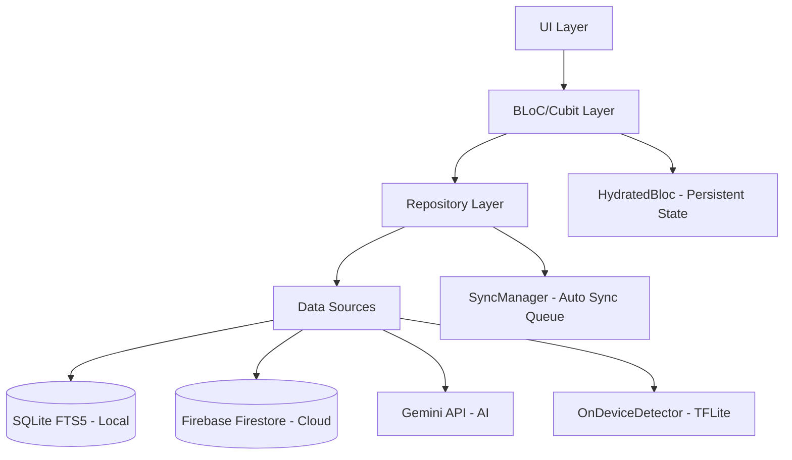

# SmartBite AI 🥗🧠

**SmartBite AI** là ứng dụng di động thông minh giúp người dùng quản lý dinh dưỡng, theo dõi lượng calo và gợi ý công thức nấu ăn dựa trên nguyên liệu sẵn có thông qua sức mạnh của AI (Gemini) và Machine Learning (TFLite).

---

## ✨ Tính năng chính

*   **Nhận diện nguyên liệu bằng AI trên thiết bị (On-Device ML)**: Ứng dụng tích hợp mô hình TensorFlow Lite (`yolov8n_food.tflite`) giúp nhận diện thực phẩm tức thời, hoạt động tốt ngay cả khi không có mạng, với cơ chế fallback sang ML Kit. Hỗ trợ nhận diện món ăn và chuyển ngữ sang tiếng Việt.
*   **Gợi ý công thức thông minh (Gemini API)**: Tạo công thức nấu ăn cá nhân hóa dựa trên nguyên liệu hiện có, chế độ ăn (Diet), dị ứng (Allergies), món thích/không thích.
*   **Trải nghiệm UI/UX mượt mà, cao cấp**: 
    *   **Concentric Rings**: Vòng tròn đồng tâm trực quan theo dõi Macronutrients (Đạm, Béo, Tinh bột).
    *   **SharedAxis Transitions**: Hiệu ứng chuyển tab (PageTransitionSwitcher) mượt mà chuẩn Material Design.
    *   **OpenContainer**: Hiệu ứng mở chi tiết món ăn phóng to mượt mà từ thẻ.
*   **Quản lý trạng thái (State Management) với BLoC/Cubit & HydratedBloc**: Quản lý state chuẩn Clean Architecture, lưu trạng thái CalorieTracker và App Settings ngay cả khi đóng app.
*   **Tìm kiếm ngoại tuyến siêu tốc (SQLite FTS5)**: Hỗ trợ tìm kiếm mờ (fuzzy search) nguyên liệu cực nhanh thông qua bảng ảo `fts5` và `unicode61` tokenizer.
*   **Đồng bộ hóa đám mây (Cloud Syncing)**: Offline-first với SQLite, sau đó đồng bộ ngầm (Sync Queue) lên Firebase Firestore khi có mạng. Có chỉ báo trạng thái đồng bộ trực quan.

---

## 🏗️ Kiến trúc & Công nghệ

Dự án áp dụng **Clean Architecture** kết hợp với mô hình **Repository Pattern**.

*   **Framework**: Flutter
*   **State Management**: `flutter_bloc` / `hydrated_bloc`
*   **Dependency Injection**: `get_it` / `injectable`
*   **Local Database**: `sqflite` (với FTS5)
*   **Cloud Backend**: Firebase (Auth, Firestore)
*   **AI / ML**:
    *   Google Gemini API (với chế độ Strict JSON Mode)
    *   TensorFlow Lite (`tflite_flutter`) cho phân tích hình ảnh On-Device.
*   **Animations**: `animations` package (OpenContainer, SharedAxis).

### Sơ đồ luồng dữ liệu



---

## 🚀 Hướng dẫn cài đặt

### Yêu cầu hệ thống
*   Flutter SDK (đã test trên phiên bản ổn định mới nhất)
*   Dart SDK
*   Firebase CLI (nếu cần config lại project Firebase)

### Các bước chạy dự án

1.  **Clone dự án**:
    ```bash
    git clone https://github.com/nguyenduythuan1771040024/smartbite.git
    cd smartbite
    ```

2.  **Cài đặt dependencies**:
    ```bash
    flutter pub get
    ```

3.  **Tạo các file generate (DI, Database...)**:
    ```bash
    flutter pub run build_runner build --delete-conflicting-outputs
    ```

4.  **Cấu hình API Key Gemini**:
    Ứng dụng yêu cầu API Key của Gemini. Khi chạy ứng dụng, bạn cần truyền API Key qua biến môi trường:
    ```bash
    flutter run --dart-define=GEMINI_API_KEY=your_api_key_here
    ```

### Hỗ trợ Web (Web Compatibility)
Dự án đã được xử lý tương thích cho Web bằng **Conditional Imports**. Tính năng TFLite (`dart:ffi`) tự động fallback sang cơ chế khác khi chạy trên nền tảng Web để tránh lỗi biên dịch.

---

## 🧪 Kiểm thử (Testing)

Dự án có độ phủ test cao (100% PASS cho các luồng quan trọng):

```bash
# Chạy Unit Tests
flutter test

# Kiểm tra tĩnh (Static Analysis)
flutter analyze
```

---

## 📁 Cấu trúc thư mục

```
lib/
├── core/
│   ├── constants/    # Theme, Colors, TextStyles
│   ├── di/           # Dependency Injection setup
│   ├── errors/       # Exception & Failure classes
│   └── utils/        # Connectivity, SyncManager
├── data/
│   ├── datasources/  # Firebase, SQLite, Gemini, TFLite (Conditional Imports)
│   ├── models/       # Data models (DTOs)
│   └── repositories/ # Repository implementations
├── domain/
│   ├── entities/     # Business logic objects
│   ├── repositories/ # Repository interfaces
│   └── usecases/     # Use cases (GenerateRecipe...)
├── presentation/
│   ├── admin/        # Admin UI
│   ├── auth/         # Login, Register
│   ├── home/         # Dashboard, Calories Tracking
│   ├── input_hub/    # Camera, ML detection, Text input
│   ├── plan/         # Meal planning
│   ├── recipe_detail/# Recipe Details (OpenContainer view)
│   ├── settings/     # App settings
│   ├── shared/       # Reusable widgets (CaloriesRing...)
│   └── stats/        # Statistics
└── main.dart         # Entry point
```
